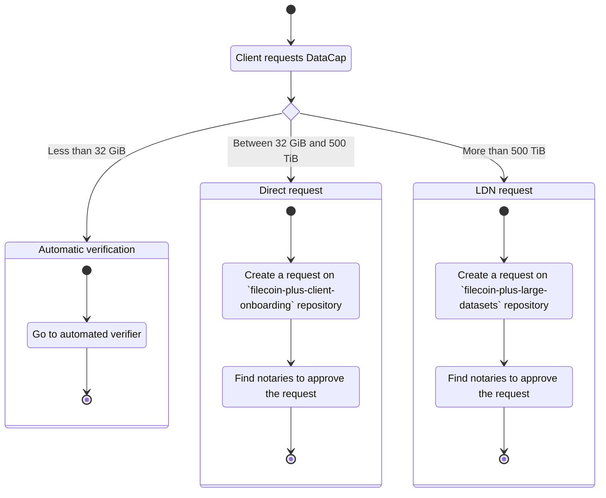

# Processes and Workflows

:::info

This page is currently a work in progress, and some information may be incomplete or subject to change. We appreciate your patience and understanding as we continue to develop and refine our documentation.

:::

## Types of requests

### Client DataCap Request

### Automated DataCap Allocation Request

### Direct DataCap Allocation Request

### LDN[^1] DataCap Allocation Request

Version: 3.0

#### Eligibility

- DataCap should be within the 500 TiB to 5 PiB range.
- Data should be public, open, and mission aligned with Filecoin and Filecoin Plus.
- Data should be accessible to anyone in the network with no restriction by special permissions or requirements.
- Data should be readily retrievable on the network, and this should be regularly verified through the use of manual or automated verification; including retrieving data from various storage providers throughout the DataCap allocation period.
- Clients should have no open disputes within the Filecoin Plus ecosystem while the application is open for review.
- A single dataset can only be eligible for a single active Large Dataset Notary, with exceptions allowed for special circumstances (e.g., for the Slingshot program).

## Workflows

### Common workflow (clients and notaries)

### Client-specific workflow

1. DataCap allocation requested
2. Answers any requests for more information
3. Receives notaries' decision if approved or not approved
   - Approved
     - Receives on-chain DataCap allocation
   - Not approved

### Notary-specific workflow

1. DataCap allocation request received
2. Performs risk assessment (e.g., due diligence, KYC)
3. Asks for more information if needed
4. Decide to approve or not approve
   - Approved
     1. Create transaction proposal on-chain
     2. Execute upon reaching required number of approvals
     3. DataCap allocated to client
   - Not approved

### GitHub workflow

#### Repo: [filecoin-project/notary-governance](https://github.com/filecoin-project/notary-governance)

#### Repo: [filecoin-project/filecoin-plus-client-onboarding](https://github.com/filecoin-project/filecoin-plus-client-onboarding)

| Label                       | Description |
| --------------------------- | ----------- |
| `bot:lookingGood`           |
| `bot:reviewNeeded`          |
| `state:Further info needed` |
| `state:Granted`             |
| `state:Verifying`           |
| `status:Error`              |

#### Repo: [filecoin-project/filecoin-plus-large-datasets](https://github.com/filecoin-project/filecoin-plus-large-datasets)

| Label                      | Description |
| -------------------------- | ----------- |
| `efil+`                    |
| `error`                    |
| `governance review needed` |
| `granted`                  |
| `ready to sign`            |
| `start sign datacap`       |
| `total datacap reached`    |
| `validated`                |

[^1]: [Large Dataset Notary](./glossary#large-dataset-notary)
